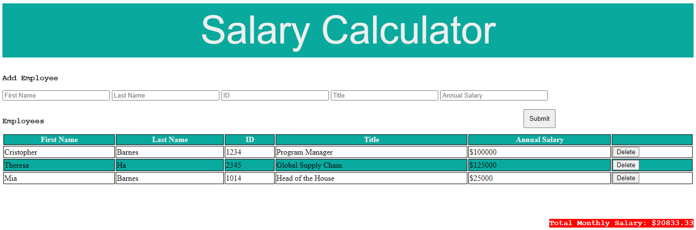

# JQuery Salary Calculator

## Description

This project is designed to track Salary expenses for your company. You can add any number of employees and track your current monthly salary based on annual salary costs.
I started developing this project by creating a base input box for each needed field and stored the appropriate entry into variables so as to track the information entered.
From there, I worked to append the inputted information onto the DOM and tracked the monthly salary to also append that information to the DOM.

## Usage

- Input Employees First Name, Last Name, Employee ID, Title, and Annual Salary (use $XXXXX as format)
- Click Submit to add them to the Table Below and Calculate Current Monthly Salary
- Add as many employees as you have to calculate total monthly salary
- If you need to remove an employee, click the appropriate 'Delete' button 

## Screenshot

## Built With

- HTML, CSS, JS, JQuery

## Acknowledgment

- Thanks to Dev for his teaching and work to provide me with the knowledge to spin this project up and make it functional
- Thanks to my wife, Theresa, for her support as I continue to learn and work on full stack development
- Thanks to my classmates for the support that they offer when I have questions.
